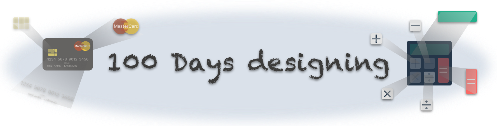

  

100 days designing is the place where I will share all my designed icons. I'm a programmer, not a designer. But I use icons in most of my projects and while it's easy to find beautiful icons on the web, I feel like it's a part of my daily job I should fulfill.

My work is totally free to use/reuse/modify/etc... See the [License section](#license) for further detail.

    <a href="#features">Features</a> • <a href="#contribution">Contribution</a> • <a href="#license">License</a>

## Upcoming

- [ ] Creating as many icons as I could
- [ ] Creating a framework to implement all these icons on iOS
- [ ] Any idea?

## Contribution

If you are interested about contributing, feel free to pull any of your work here. I didn't think the structure of this repository yet so it may be updated in the future.

## License

Copyright (c) 2016 SebastienFCT

Permission is hereby granted, free of charge, to any person obtaining a copy
of this software and associated documentation files (the "Software"), to deal
in the Software without restriction, including without limitation the rights
to use, copy, modify, merge, publish, distribute, sublicense, and/or sell
copies of the Software, and to permit persons to whom the Software is
furnished to do so, subject to the following conditions:

The above copyright notice and this permission notice shall be included in all
copies or substantial portions of the Software.

THE SOFTWARE IS PROVIDED "AS IS", WITHOUT WARRANTY OF ANY KIND, EXPRESS OR
IMPLIED, INCLUDING BUT NOT LIMITED TO THE WARRANTIES OF MERCHANTABILITY,
FITNESS FOR A PARTICULAR PURPOSE AND NONINFRINGEMENT. IN NO EVENT SHALL THE
AUTHORS OR COPYRIGHT HOLDERS BE LIABLE FOR ANY CLAIM, DAMAGES OR OTHER
LIABILITY, WHETHER IN AN ACTION OF CONTRACT, TORT OR OTHERWISE, ARISING FROM,
OUT OF OR IN CONNECTION WITH THE SOFTWARE OR THE USE OR OTHER DEALINGS IN THE
SOFTWARE.

## Buy me a coffee? :coffee:

My work is totally free of use/reuse/modification. I love open-sourcing as least as much as I love programming

Anyway, If you like it feel free to ask for [improvement](https://github.com/SebastienFCT/FCTBubbleChat/issues), [email me](mailto:sebastienfct@gmail.com), [contributing](#contribution) and/or donate:

| Paypal | Bitcoin |
| ------ | ------- |
|  |  
  
 |
